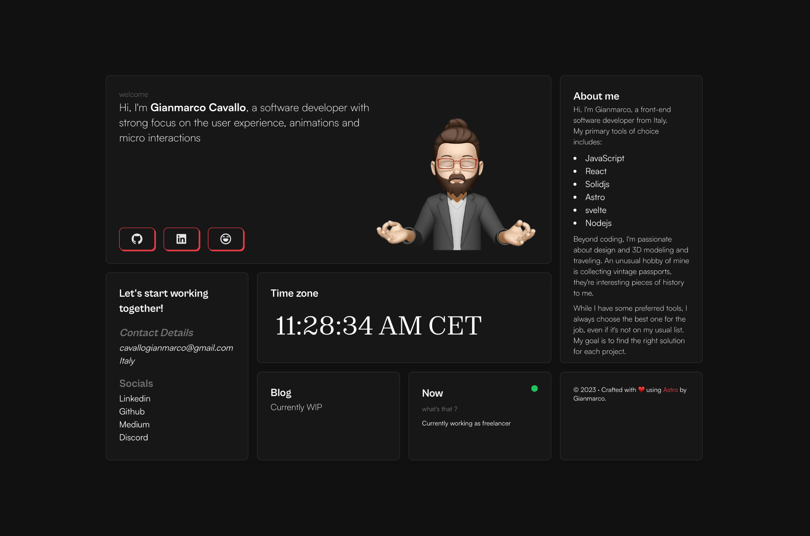

# 🚀 Astro Bento Portfolio

## A personal portfolio website made using `Astro`.



## TODOs

[ ] Metadata
```html
<meta property="og:title" content="Title">
<meta property="og:description" content="Description">
<meta property="og:image" content="Image URL">
<meta property="og:url" content="URL of the page/article/post">

<meta name="twitter:title" content="Title">
<meta name="twitter:description" content="Description">
<meta name="twitter:image" content="Image URL">
<meta name="twitter:card" content="summary_large_image"> <!-- how the card is displayed -->
```
- [Facebook Sharing Debugger](https://developers.facebook.com/tools/debug/sharing/)

- [Twitter Card Validator](https://cards-dev.twitter.com/validator)
[ ] Icons and Favicon
[ ] Performance

    Run some overall tests:

    PageSpeed Insights
    Web Page Performance Test

    Optimize images with ImageOptim on Mac or Kraken.io Web Interface
    Check loading times at GPRS or EDGE speed
    Check accessibility at tiny screens
    Check links and interactive elements for fat-fingers

[ ] All images have alt text
[ ] Remove unused CSS using [PurgeCSS](https://github.com/FullHuman/purgecss)
[ ] Look into using @astrojs/mdx & other integrations [Astro Integrations](https://astro.build/integrations/)
[ ] Add Glow animation whenever there is a hover over a card
[ ] Show timeline of projects done in year
[ ] Instead of map, show running stats on strava (using a dashboard)
    - Need to transfer data from NRC to Strava


## REMOVE THE umami analytics script tag (or replace it with your id) in `src/layouts/Layout.astro`

# Configuration

remember to replace the `site` and other properties with your data in `astro.config.mjs`
